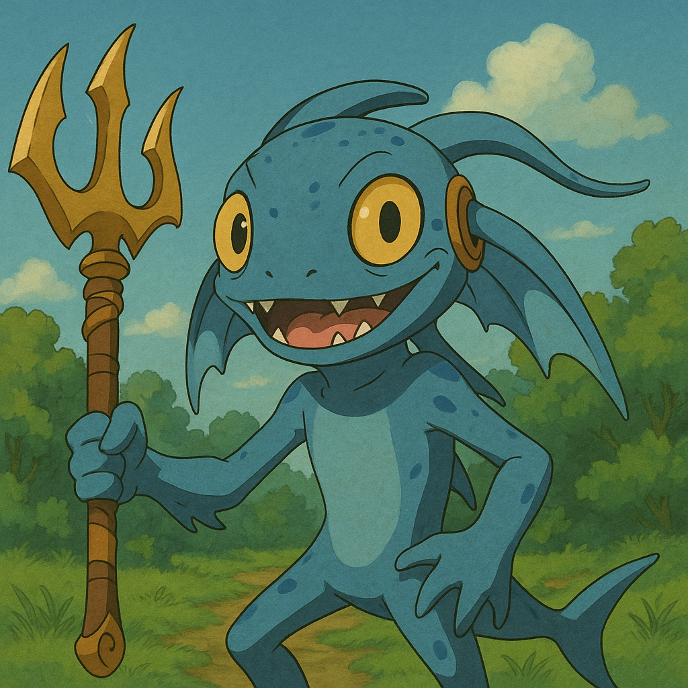

## SK네트웍스 Family AI Camp 훈련 도우미

## 0. 팀 소개
  ## 프로젝트명: SK네트웍스 Family AI 매니저 '하루'

  ## 팀원 소개

<table align="center" width="100%">
  <tr>
    <td align="center">
      <a href="https://github.com/PyeonMin"><b>@편성민</b></a>
       
      
    </td>
    <td align="center">
      <a href="https://github.com/phjoon1012"><b>@박현준</b></a>
       
      
    </td>
    <td align="center">
      <a href="https://github.com/KimJaeHyeok01"><b>@김재혁</b></a>
       
      
    </td>
    <td align="center">
      <a href="https://github.com/wjstjqls"><b>@전서빈</b></a>
       
      
    </td>
    <td align="center">
      <a href="https://github.com/yhcho0319"><b>@조영훈</b></a>
       
      
    </td>
  </tr>
</table>

## 프로젝트 개요

이 챗봇은 SK네트웍스 Family AI Camp의 수강생, 매니저, 강사 등 캠프 구성원들이  
실시간으로 정보를 얻고, 고민을 상담하며, 캠프 생활을 더 편리하게 할 수 있도록  
설계된 **AI 매니저 '하루(HARU)'** 챗봇 시스템입니다.

---

## 주요 기능

- **실시간 대화**  
  - 캠프 일정, 출결, 시설, 학습, 생활 등 다양한 질문에 즉각 응답
  - 친근하고 전문적인 하루 캐릭터의 말투와 응원 메시지

- **RAG 기반 지능형 검색**  
  - campusfaq.csv, PDF, 텍스트 등 다양한 문서에서 의미적으로 관련 있는 정보를 찾아 답변
  - OpenAI 임베딩을 활용한 벡터 검색 + LLM 생성 결합

- **추천 질문/예시 질문 제공**  
  - 자주 묻는 질문을 랜덤으로 추천하여 사용자의 탐색 편의성 향상

- **상황별 안내 및 에러 처리**  
  - 확실하지 않은 정보는 담당 매니저 안내
  - 오류 발생 시 친절한 사과 메시지와 대체 질문 제안

- **프론트엔드 인터랙션**  
  - 추천 질문 버튼, 감정 상태 등

---

## 기술 스택

| 구분 | 기술 | 설명 |
|------|------|------|
| **언어/환경** | Python, `.env` | 전체 백엔드 로직 구현, 환경 변수 관리 |
| **데이터 수집** | PyPDF2, 파일 I/O | CSV, PDF, TXT 등 문서 로딩 |
| **데이터 처리** | pandas, numpy | 데이터프레임 변환, 수치 연산 등 |
| **문서 처리** | LangChain, 문서 청크 분할 모듈 | 긴 문서 청크 처리 및 문서 변환 |
| **벡터 저장소** | FAISS (추가 예정), LangChain 내장 벡터 검색 | 벡터 검색 기반 유사 문서 조회 |
| **임베딩 모델** | OpenAIEmbeddings | 문서 및 쿼리 임베딩 |
| **LLM** | OpenAI GPT-3.5-turbo | 컨텍스트 기반 응답 생성 |
| **RAG 엔진** | Retriever + LLM (LangChain RAG 구조) | 문서 검색 후 GPT 응답 결합 |
| **추천 질문 기능** | 랜덤 추출 (FAQ 기반) | 사용자 탐색 편의성 제공 |
| **프론트엔드** | HTML, CSS, JavaScript, Bootstrap, Canvas | 챗 UI 및 캐릭터 인터페이스 구현 |
| **배포 인프라** | AWS Elastic Beanstalk, S3, Route 53, ACM, RDS 등 | 도메인 연결, 인증서 발급, 오토스케일링 등 |

## 데이터 수집 및 전처리

### 데이터 출처

#### 주요 데이터 소스

- **네이버 블로그**
  - 네이버 검색 API 및 웹 크롤링을 통한 수집
  - 비로그인 오픈 API 키(Client ID, Client Secret) 활용

- **유튜브 영상**
  - YouTube Data API를 통한 자막 데이터 수집
  - 영상 메타데이터(제목, 채널명, 업로드 날짜 등) 포함

- **회고록 블로그**
  - 7~12기 부트캠프 수료생 블로그 회고록
  - 부트캠프 입소자들의 경험과 문제점 정형화

- **구글 설문**
  - 수강생들의 생생한 고충과 경험 공유
  - 실시간 피드백 수집

### 데이터 구조

#### CSV 파일 구조

- campusfaq.csv: 캠퍼스 관련 FAQ 데이터
- coding_tips.csv: 코딩 팁 및 학습 자료
- codingstudy.csv: 코딩 학습 관련 데이터

#### 주요 컬럼
- id: 고유 식별자
- url: 원본 데이터 URL
- upload_date: 데이터 수집/업로드 날짜
- title: 제목
- content: 본문 내용

### 데이터 전처리

#### 텍스트 정제
  - 비속어 및 부적절한 콘텐츠 필터링
  - HTML 태그 제거
  - 특수문자 및 이모지 정리

#### 데이터 정규화
  - 날짜 형식 통일
  - URL 정규화
  - 텍스트 인코딩 통일 (UTF-8)

## 시스템 구조

### 1. **백엔드**

#### `chatbot_logic.py`
- **문서 데이터 로딩**: FAQ, CSV, TXT, PDF 등 다양한 소스에서 문서 수집
- **임베딩(벡터화)**: OpenAI 임베딩 API로 모든 문서와 질문을 벡터화
- **유사도 검색**: 코사인 유사도로 질문과 가장 비슷한 문서 K개 추출
- **LLM 답변 생성**: 관련 문서(컨텍스트)와 함께 OpenAI GPT-3.5-turbo로 답변 생성
- **추천 질문**: FAQ 기반 랜덤 추천 질문 제공
- **에러 처리**: 예외 발생 시 사과 메시지와 추천 질문 반환

#### `document_processor.py`
- **텍스트 청크 분할**: 긴 문서를 LLM 입력에 맞게 청크로 분할
- **(확장 예정) 쿼리 강화**: 대화 히스토리 기반 쿼리 가공

---

### 2. **프론트엔드**

#### `chat.html`
- **챗봇 UI**: 대화창, 입력창, 추천 질문, 감정 상태, 캐릭터 영역 등
- **캐릭터 시각화**: SVG
- **추천 질문 버튼**: 클릭 시 입력창에 자동 입력

---

## 벡터화(임베딩)와 검색

- **임베딩 모델**: OpenAIEmbeddings 
- **문서/질문 벡터화**: 모든 문서와 사용자의 질문을 벡터로 변환
- **유사도 계산**: 코사인 유사도로 의미적으로 가장 가까운 문서 검색
- **RAG 구조**: 검색된 문서를 LLM에 컨텍스트로 넣어 더 정확한 답변 생성

---

## 데이터 흐름

1. **문서 수집**: FAQ, CSV, TXT, PDF 등 다양한 소스에서 데이터 로딩
2. **임베딩**: 모든 문서와 질문을 벡터로 변환
3. **검색**: 질문과 가장 유사한 문서 K개 추출
4. **LLM 답변**: 관련 문서와 함께 OpenAI GPT-3.5-turbo로 답변 생성
5. **프론트엔드 표시**: 답변, 추천 질문, 캐릭터 애니메이션 등 UI에 표시

---

## 기술 스택

- **백엔드**: Python, OpenAI API, Langchain, Pandas, PyPDF2, Numpy, dotenv
- **임베딩/검색**: OpenAIEmbeddings, 코사인 유사도, 벡터 기반 검색
- **프론트엔드**: HTML, CSS, JavaScript, Canvas, Bootstrap
- **데이터**: CSV, TXT, PDF 등 다양한 문서 포맷

---

## 배포

- **AWS Route 53**: 퍼블릭 도메인을 AWS DNS로 매핑
- **AWS Certificate Manager**: SSL 인증서 발급 후 확인 -> HTTPS 요청
- **AWS Elastic Beanstalk**: AWS S3, AWS ELB, AWS RDS, AWS Cloudwatch, EC2 instances, Auto Scaling 등의 서비스 연동을 자동화 

---

## 사용 예시

- **실시간 질문**: "오늘 점심은 언제인가요?" → 관련 FAQ/문서 검색 후 LLM 답변
- **추천 질문**: "출결 확인 방법", "캠프 일정", "상담 신청" 등 랜덤 추천
- **캠퍼스 FAQ 제공**: 수강생들이 자주 묻는 질문들 정리

---

## 확장/개선 방향

- 벡터 DB(Pinecone, FAISS 등) 연동
- 사용자별 맞춤 추천 질문
- 대화 히스토리 기반 쿼리 강화
- 더 다양한 캐릭터/애니메이션 지원

---

## 참고

- [OpenAI Embeddings 공식 문서](https://platform.openai.com/docs/guides/embeddings)

---

## 회고

**박현준**: AWS와 웹 관련 기술에 대해 알아볼 수 있는 좋은 경험이었습니다. 팀원들께서 많이 도와주셔서 함께 알아가는 재미도 있었던 것 같습니다. 최종 프로젝트도 수강생 여러분 모두 건승을 빕니다.

**편성민**: 지난번 프로젝트에 이어 발전시켜 잘 마무리할 수 있었습니다. 팀원분들의 도움으로 이번 프로젝트도 잘 끝낼수 있어 감사하게 생각하고 있습니다. 

**전서빈**: 다시 한번 챗봇을 만들 수 있어 좋았고, 그 챗봇을 AWS를 통해 팀장님 및 팀원분들과 함께 배포까지 해볼 수 있어 좋은 경험이었습니다.

**조영훈**: 웹 관련 기술을 실제로 적용해 볼 수 있는 좋은 기회였고 팀장님이 잘 이끌어 주셔서 좋았습니다.

**김재혁**: AWS 관련 기술들을 공부하는 좋은 기회였던 것 같습니다. 다른 팀원분들이 너무 잘해주셔서 감사했습니다.

